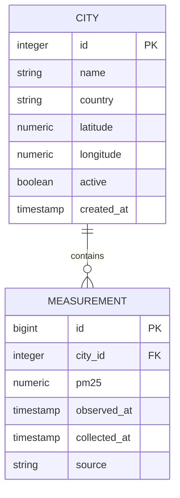

# AeroC V2 Database Design

**Version:** 2.0.0
**Status:** Draft
**Last Updated:** July 2026

---

# Purpose

This document defines the logical database architecture for AeroC V2.

The database is the authoritative source of environmental observations collected by the platform. It is designed to support automated data ingestion, historical analysis, and downstream analytics while maintaining data integrity and extensibility.

This document describes **what** is stored, **why** it is stored, and the relationships between entities. Implementation details such as SQLAlchemy models and Alembic migrations are intentionally excluded.

---

# Design Objectives

The AeroC database is designed around the following objectives:

* Preserve every environmental observation.
* Separate static reference data from dynamic observations.
* Eliminate unnecessary data duplication.
* Support long-term historical analysis.
* Enable future expansion without significant schema redesign.
* Keep operational complexity appropriate for the current project scope.

---

# Design Principles

## 1. PostgreSQL is the Source of Truth

Once a measurement has been validated and stored, PostgreSQL becomes the authoritative source of data.

No downstream component should depend directly on third-party APIs.

---

## 2. Normalize Reference Data

Reference entities exist once.

Examples include:

* Cities
* (Future) Countries
* (Future) Data Sources

Environmental observations reference these entities using foreign keys.

---

## 3. Preserve History

Measurements are immutable.

Historical observations must never be overwritten or deleted during normal operation.

Corrections should create new records rather than modifying historical data.

---

## 4. Support Automation

The scheduler determines *when* data is collected.

The database determines *what* is collected.

The scheduler should obtain monitored cities directly from the database.

---

## 5. Database Generates System Timestamps

Creation timestamps should be generated by PostgreSQL.

This ensures consistency across multiple application instances.

---

## 6. Design for Growth

The schema should support future additions without requiring major redesign.

Examples include:

* additional pollutants
* additional countries
* additional providers
* machine learning datasets
* operational monitoring

---

# Entity Relationship Diagram



---

# Entity: City

## Purpose

Represents a monitored geographic location within the AeroC monitoring network.

Cities are relatively static reference data used by the scheduler to determine which locations should be monitored.

---

## Attributes

| Attribute  | Description                                      |
| ---------- | ------------------------------------------------ |
| id         | Primary key                                      |
| name       | City name                                        |
| country    | Country name                                     |
| latitude   | Geographic latitude                              |
| longitude  | Geographic longitude                             |
| active     | Indicates whether the city is actively monitored |
| created_at | Timestamp when the city was registered           |

---

## Constraints

* `(name, country)` must be unique.
* Latitude must be within valid geographic bounds.
* Longitude must be within valid geographic bounds.
* City names cannot be null.
* Inactive cities remain in the database for historical consistency.

---

## Relationships

One City may have many Measurements.

Cities should never store pollutant values.

---

# Entity: Measurement

## Purpose

Represents a single PM2.5 observation collected from an external provider for a specific city at a specific point in time.

Each record is immutable.

---

## Attributes

| Attribute    | Description                                 |
| ------------ | ------------------------------------------- |
| id           | Primary key                                 |
| city_id      | References City                             |
| pm25         | PM2.5 concentration (µg/m³)                 |
| observed_at  | Timestamp reported by the provider          |
| collected_at | Timestamp when AeroC stored the measurement |
| source       | Name of the external provider               |

---

## Constraints

* Every measurement belongs to one City.
* PM2.5 values cannot be negative.
* Timestamps cannot be null.
* Historical records are never updated.

---

## Relationships

Many Measurements belong to one City.

---

# Normalization Strategy

The AeroC schema intentionally separates relatively static reference data from continuously collected observations.

Reference information is stored once and referenced by foreign keys.

This prevents unnecessary duplication across potentially millions of measurements.

Example:

Instead of storing

```
Manila
Philippines
14.5995
120.9842
```

within every measurement, those values exist once in the City table.

Measurements reference the corresponding City using `city_id`.

---

# Data Lifecycle

```text
Scheduler
    │
    ▼
Collector
    │
    ▼
Validation
    │
    ▼
Measurement Created
    │
    ▼
Stored in PostgreSQL
    │
    ▼
Served through API
    │
    ▼
Consumed by Dashboard
```

---

# Indexing Strategy

The following indexes are expected.

## City

* Primary Key (`id`)
* Unique (`name`, `country`)
* Index (`active`)

---

## Measurement

* Primary Key (`id`)
* Index (`city_id`)
* Index (`observed_at`)
* Composite Index (`city_id`, `observed_at`)

These indexes are chosen to optimize the most common query patterns:

* latest measurement per city
* historical trend for one city
* scheduler lookups

---

# Future Schema Evolution

The following entities are expected in future versions but are intentionally excluded from the V2 MVP.

## Country

Normalizes country information once multiple countries require richer metadata.

---

## DataSource

Represents external environmental data providers.

Examples:

* Open-Meteo
* OpenAQ
* Government APIs

---

## CollectionRun

Represents a scheduled collection execution.

Potential attributes:

* execution status
* start time
* finish time
* processed cities
* failed cities
* execution duration

This entity enables operational monitoring and troubleshooting.

---

## WeatherObservation

Stores weather variables associated with environmental observations.

Potential attributes include:

* temperature
* humidity
* wind speed
* precipitation

---

# Query Philosophy

The database is optimized for read-heavy analytical workloads.

Typical queries include:

* Latest measurement for every city.
* Historical trend for a single city.
* Historical trend by country.
* Top polluted cities.
* Average PM2.5 by day.
* Average PM2.5 by month.

Schema design should continue to prioritize these access patterns.

---

# Out of Scope

The following are intentionally excluded from AeroC V2:

* User accounts
* Authentication
* Authorization
* Notifications
* Prediction models
* Data editing interfaces
* Manual measurement entry

These features belong to future platform iterations.

---

# Revision History

| Version | Description                                |
| ------- | ------------------------------------------ |
| 2.0.0   | Initial database architecture for AeroC V2 |
